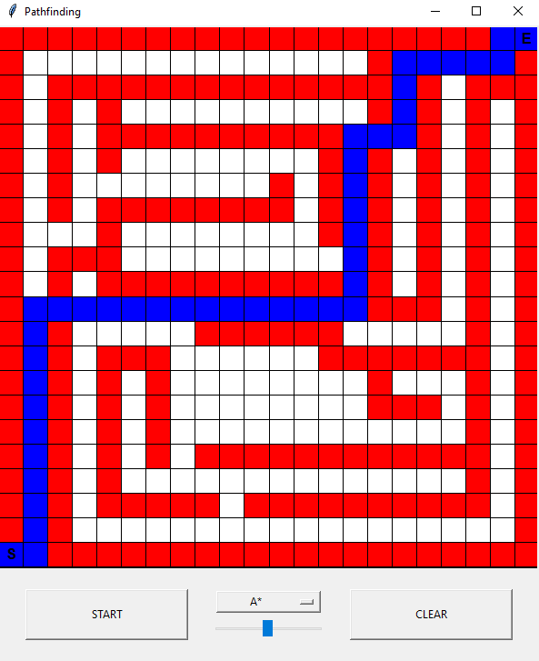

# Pathfinding Game

## Description

Simple game where you can place a starting point, a goal and walls. The used pathfinding algorithm will be used to find a route from the starting point to the goal. Pathfinding will be visualized and the speed can be adjusted.

## Visuals


## Getting Started

### Dependencies

* Python

### Installing

```
git clone https://github.com/ValvojaX/pathfinding-game.git
```

### Executing program

```
python main.py
```

## Version History

* 0.1
    * Initial Release